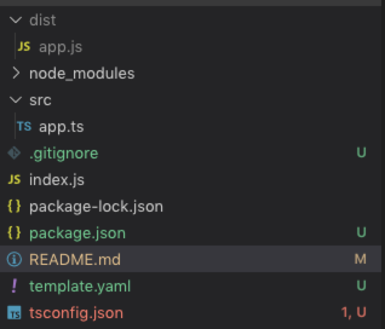
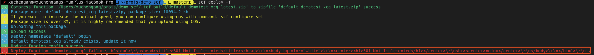
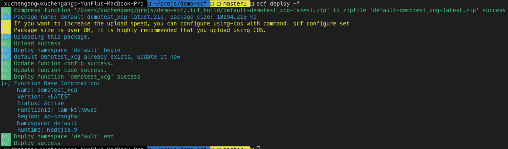
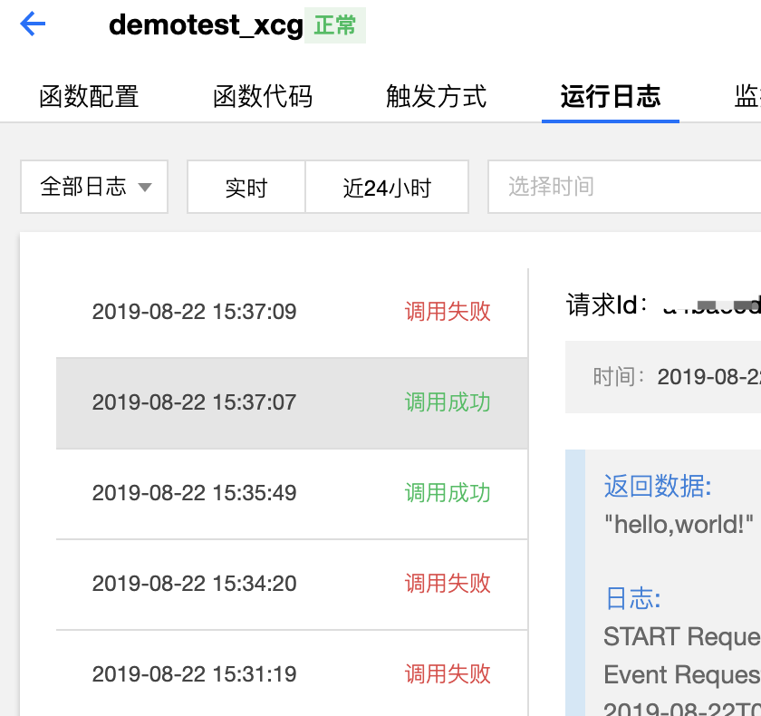

# demo-scf

腾讯无服务器云函数测试 demo，用 typescript 写的，基于 node

> 部分引用[《云函数 + TypeScript + Node.js 最佳实践探索》](https://cloud.tencent.com/developer/article/1483690)

> 云函数相关请见 [腾讯云函数官方文档](https://cloud.tencent.com/document/product/583/9199)

## 环境搭建

---

- 本地安装 python 和 pip[pip 和 python 安装说明](https://www.jianshu.com/p/62bea7d3708c)
- vscode 安装 scf 插件
  [scf 插件安装说明](https://cloud.tencent.com/document/product/583/36208)
- 配置插件 创建腾讯云用户凭证

## 初始化项目

---

使用 scf init（具体参数得去看文档填写，这个提个建议，scf init 提供交互式操作，采取问答的模式去创建）

## 编译

---

> scf 不支持 ts，需要将 ts 文件代码编译为 js 代码
> 可不可以在根目录写一个 index 文件，然后调用编译后的 index 文件的入口方法?本地开发的项目代码和交到云上的项目代码是一致的，不需要通过额外的脚本去阉割

实施方法即是，把 typescript 文件放在 src 文件夹下，编辑后的 js 文件放在 dist 文件夹下，在根目录编写一个 index.js 文件，文件里的 main_hanlder 方法调用编译后的 index 文件的入口函数，下面是一些核心代码。

**index.js**

```
"use strict";
const { main_handler } = require("./dist/index");
exports.main_handler = async function(event, context, callback) {
  return await main_handler(event, context, callback);
};
```

**tsconfig.json**

```
"outDir": "./dist",
"baseUrl": "./",
"rootDir": "./src"
```

**template.json**

```
CodeUri: ./
Type: Event
Description: This is a template function
Environment:
    Variables:
    ENV_FIRST: env1
    ENV_SECOND: env2
Handler: index.main_handler
```

编译后的结果



## 部署

---

切换项目根目录，执行命令

```
scf deploy -f #部署命令，scf会基于模版配置文件执行部署过程 -f:强制执行
```

如果出现下图错误，尝试重新执行部署命令


部署成功如下图


## 测试

---

在函数服务中查看对函数进行简单测试

